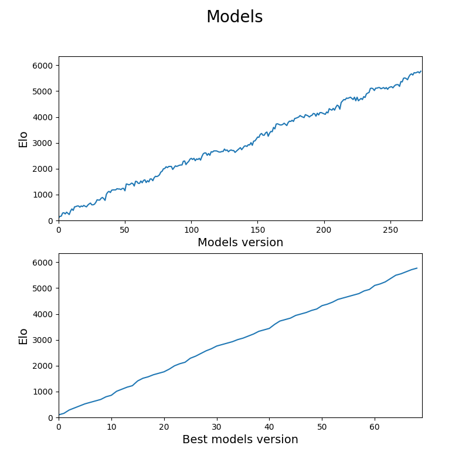
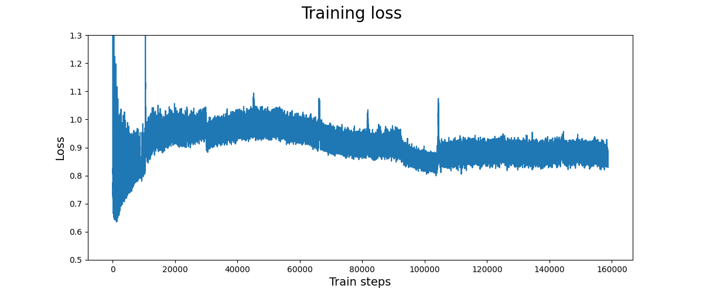

# Aphla Reversi
This model implements the [Alpha Zero paper](https://www.gwern.net/docs/rl/2017-silver.pdf) on the game of Reversi/Orthello. 

The overall algorithm is divided into three parts:
1. **Self-play**
    * The current best model plays itself to generate training data. 
    * Each game takes about 10 seconds to complete.
1. **Training**
    * A model is fed the training data generated from self-play. 
    * The input to the model is the current board state with history.
    * The labels are the policy evaluated by MCTS, and the value given by the final winner of the game.
    * This model is trained for ~30hours.
1. **Evaluation**
    * The newly trained model competes with the current best model. It replaces the current best if it wins. 
    * Each games takes about 20 seconds to complete.

---

### Model elo over time

### Training loss over time

